# My-IT-Profolio
 A collection of my IT projects including Networking, SQL, Web Development, IOT Projects and Python script.
# 🚀 Nay Oo Lwin | IT Technical Portfolio
Welcome to my repository. This collection showcases the technical skills and projects I developed during my HND in Computing and ongoing B.Sc. in Computer Science studies.

---

## 📊 1. Database Management (SQL)
Relational database design and query execution. This example demonstrates creating an employee record and retrieving data accurately.

* **Project:** Employee Database Management
* **Key Skills:** Table Creation, Data Insertion, Data Retrieval (SELECT queries).

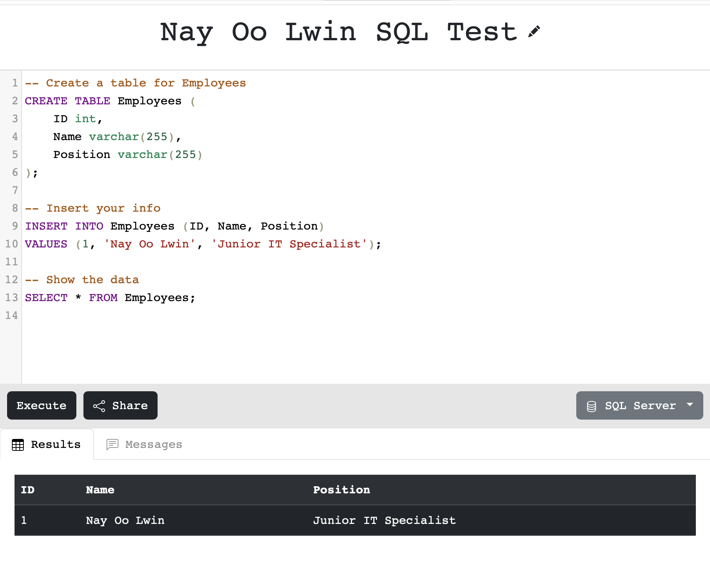

---

## 🌐 2. Networking (Cisco Infrastructure Design)
Designed a scalable office network topology with centralized server access using Draw.io.

---

## ⌨️ 3. JavaScript & Web Development
Implementing functional logic and dynamic user interfaces.
<table>
  <tr>
    <td><b>Interface Design</b></td>
    <td><b>Interface Design</b></td>
    <td><b>JS Logic & Testing</b></td>
  </tr>
  <tr>
    <td>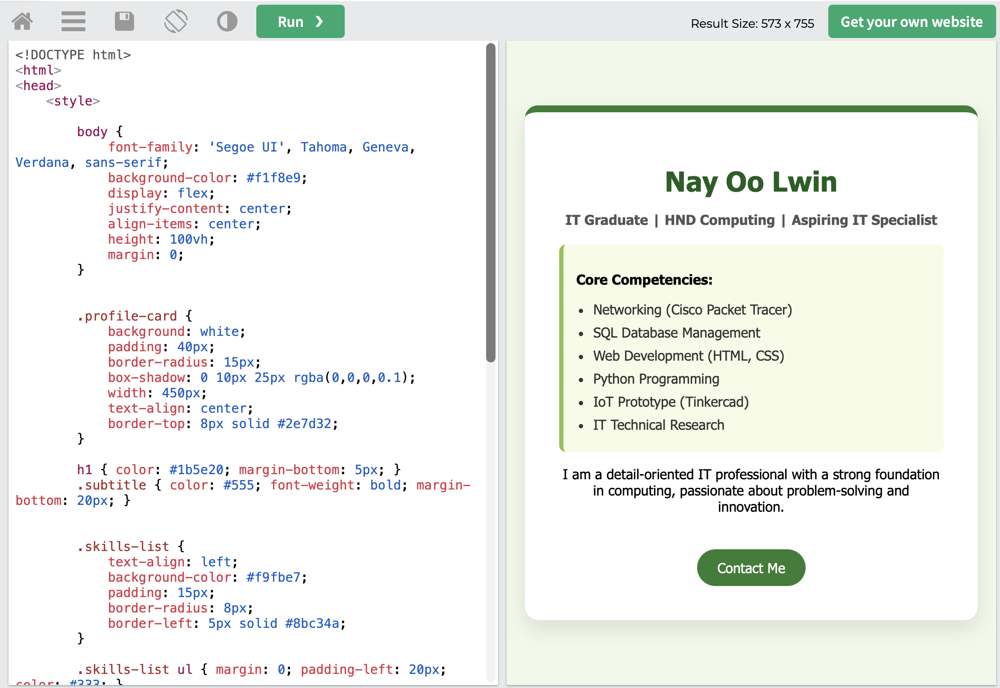</td>
    <td>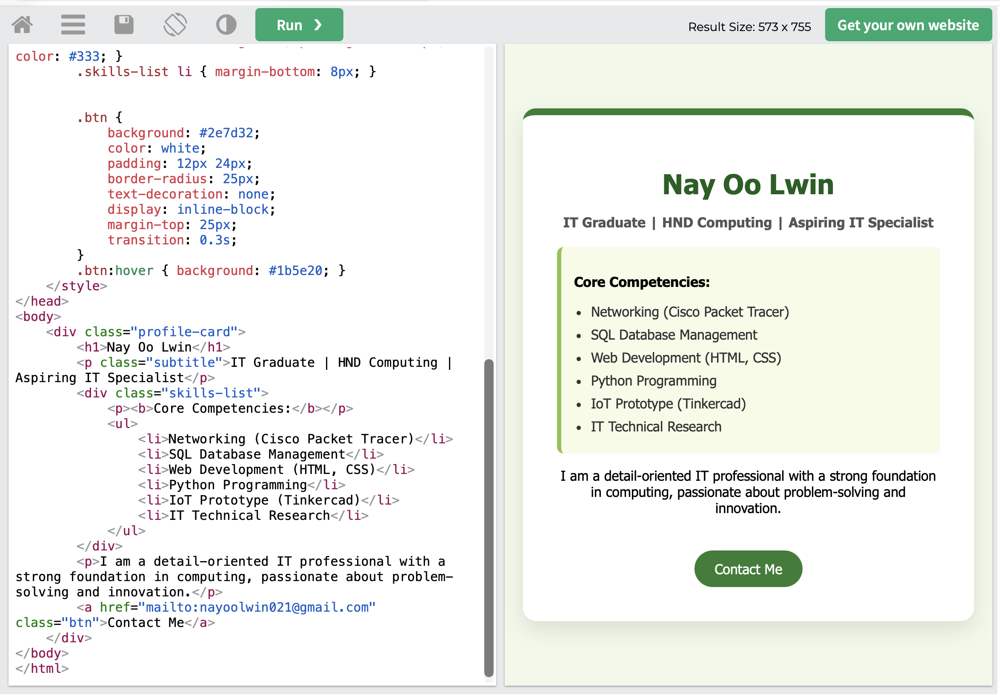</td>
    <td>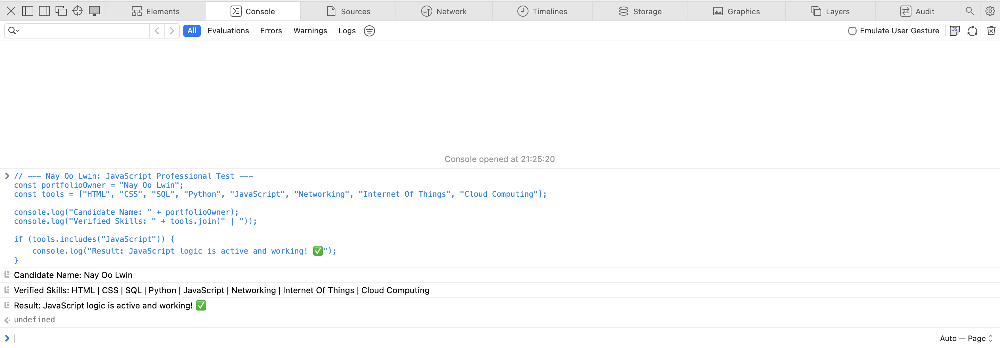</td>
  </tr>
</table>

---

## 🤖 4. IoT & Smart Systems (Tinkercad)
Hardware simulations for automation and safety using Arduino and various sensors.

### 🛠️ Project Portfolio & Wiring
<table>
  <tr>
    <th>System Type</th>
    <th>Wiring Setup</th>
    <th>Programming Logic</th>
  </tr>
  <tr>
    <td><b>Gas Leakage Detector</b></td>
    <td>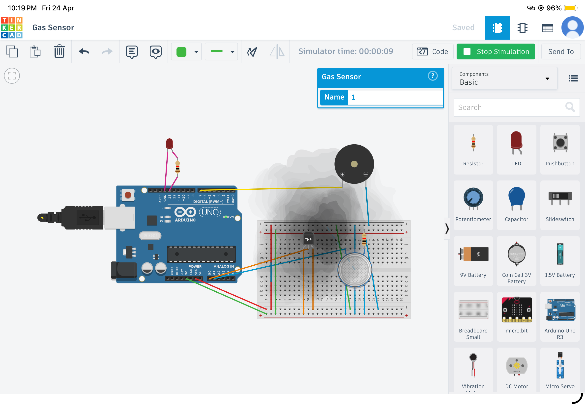</td>
    <td>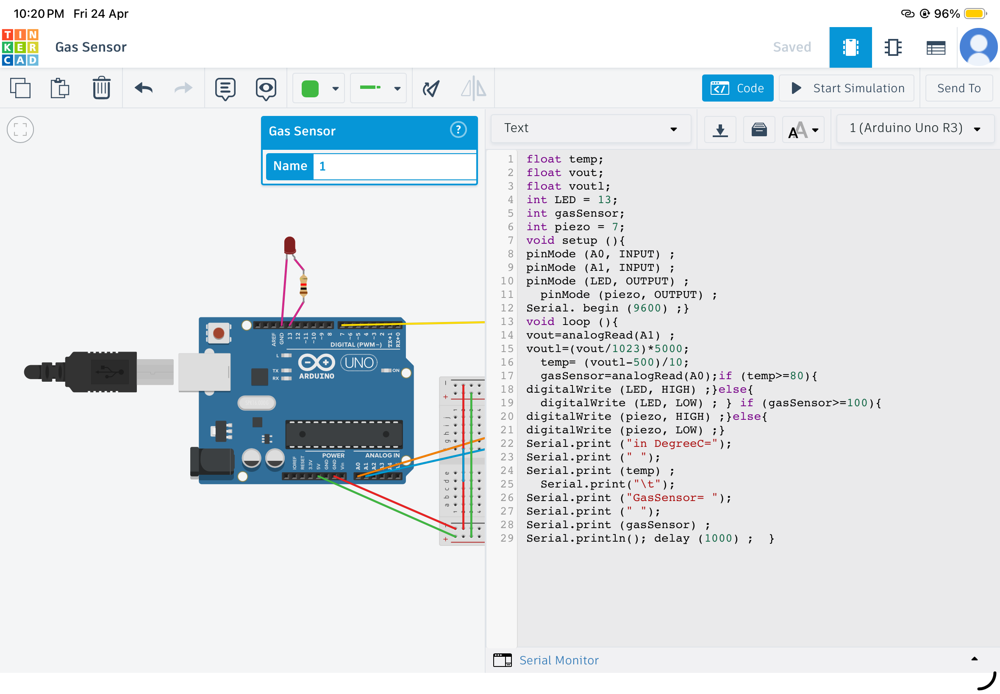</td>
  </tr>
  <tr>
    <td><b>Ultrasonic Door Buzzer</b></td>
    <td>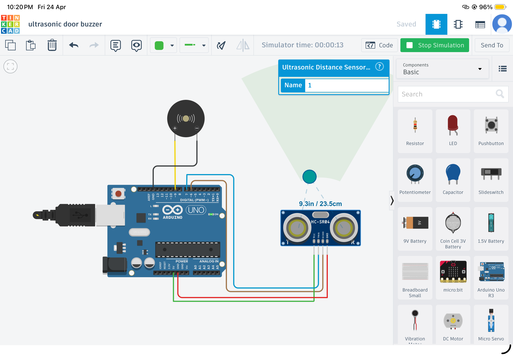</td>
    <td>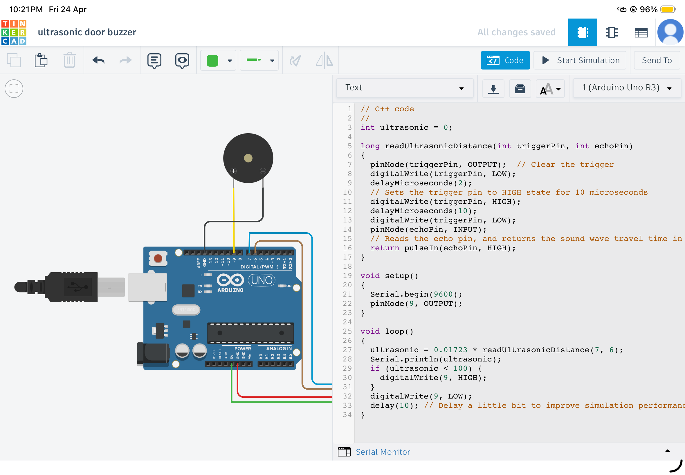</td>
  </tr>
  <tr>
    <td><b>Pet Motion Alarm</b></td>
    <td>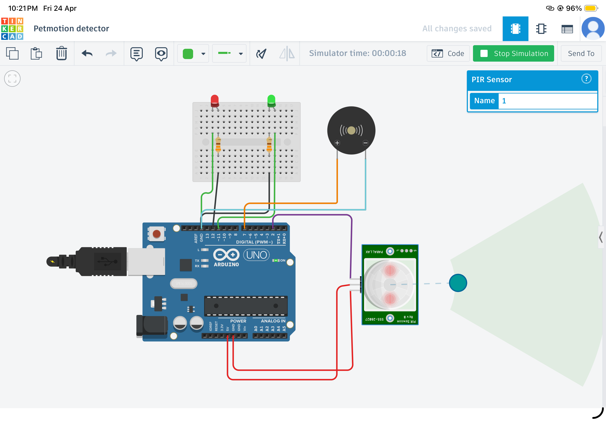</td>
    <td>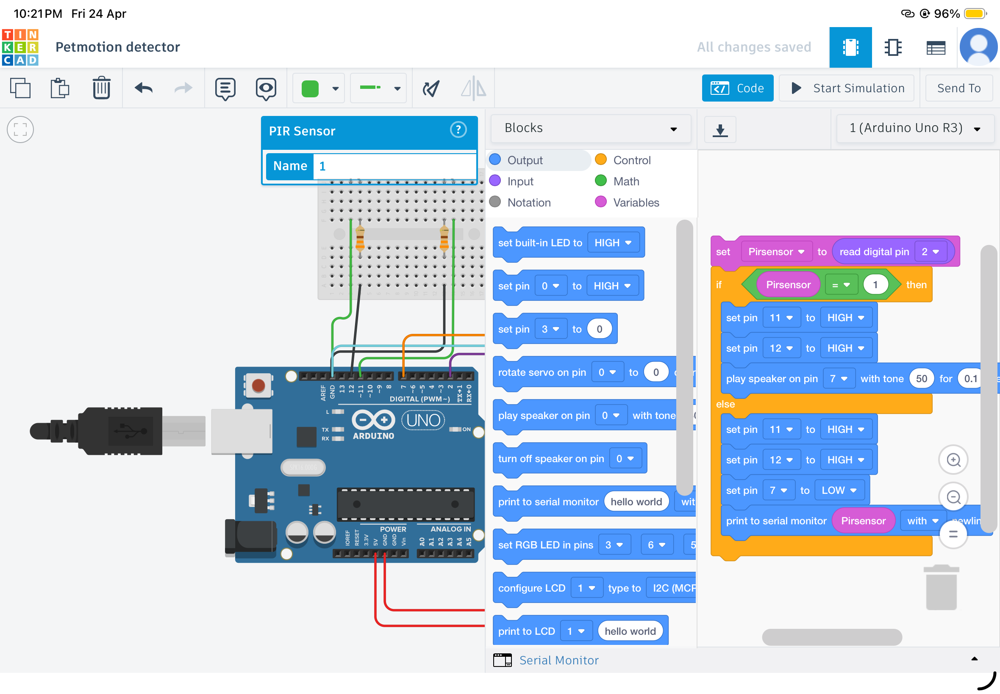</td>
  </tr>
</table>

---

## 🎨 5. 3D Modeling & Creative Assets
Tinkercad 3D designs for product prototyping and visual branding.

<table>
  <tr>
    <td>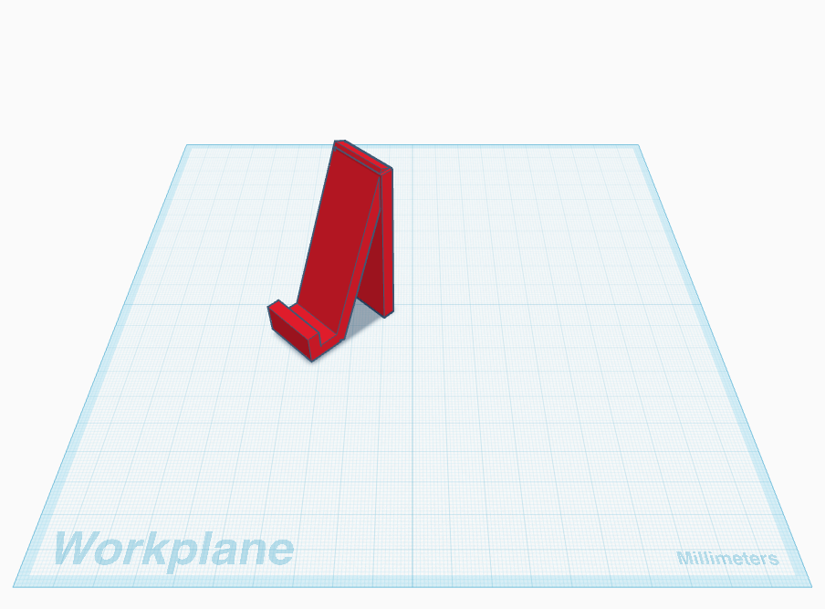</td>
    <td>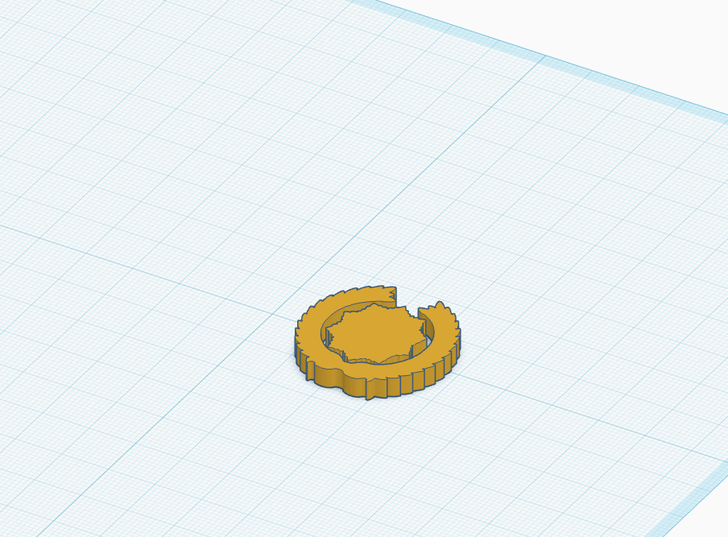</td>
    <td>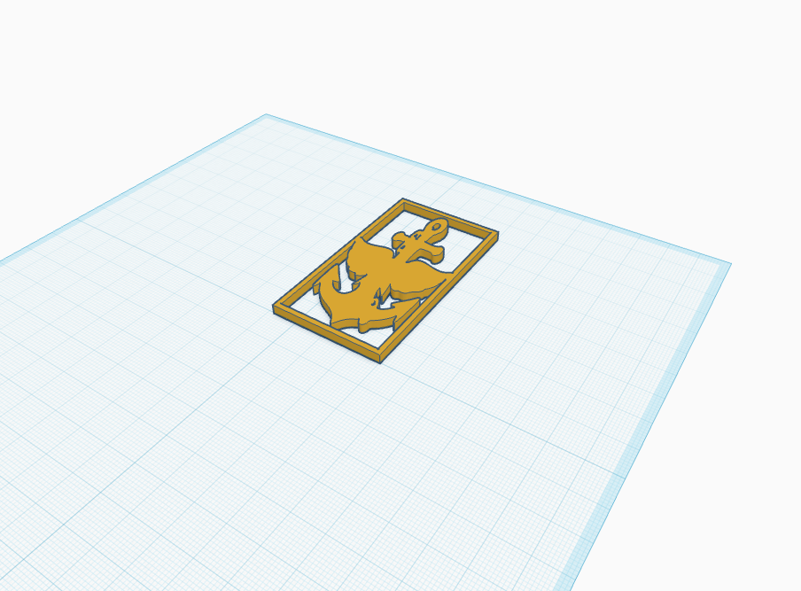</td>
  </tr>
</table>

---

## 📫 Contact Me
* **Name:** Nay Oo Lwin
* **Role:** Junior IT Specialist
* **Location:** Bangkok, Thailand

